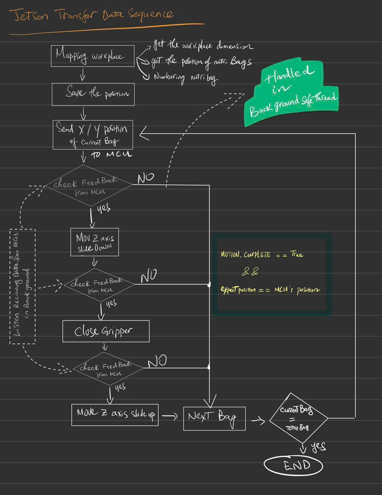

---
## Introduction

FARMBOT is a research and learning project aimed at developing an automated system for **sowing, picking, and transplanting seedlings**.

The system is built on a **3-DOF gantry mechanism** and uses **UART communication** to exchange data between a **Jetson Nano** and an **ESP32**. 

The Jetson Nano is responsible for **camera processing and object/field detection**, while the ESP32 controls the motors based on the received position data.

This repository focuses on the **Jetson-side implementation**, including:
- UART communication
- Camera handling
- Vision processing
- Sending position commands to the ESP32
## System Pipeline

<p align="center">
  
</p>

## Notes

- **This project is intended for research and learning purposes only.**  
  It is **not designed for commercial agricultural production**.
- The `docs/` folder contains documentation related to the FarmBot system.
- The `others/` folder includes supporting files such as SolidWorks designs, images, and diagrams.
- The `test/` folder contains scripts used for testing and debugging.
## UART USB Permission Setup

### Jetson Nano
```bash
sudo chmod 666 /dev/ttyUSB0 
```
### Raspberry Pi
```bash
sudo raspi-config
```
- Select: 3. Interface Options
- Select: I6 Serial Port
- Select: Yes
## Clone my project

```bash
git clone https://github.com/minhthong2514/FreeJobs.git
```
## How to use my code

**Move to `src/` folder**
```bash
cd src
```
**Run file main.py**
```bash
python3 main.py
```
## Requirements

- **Python >= 3.6**
- **opencv**
- **numpy**
- **pyserial**
---